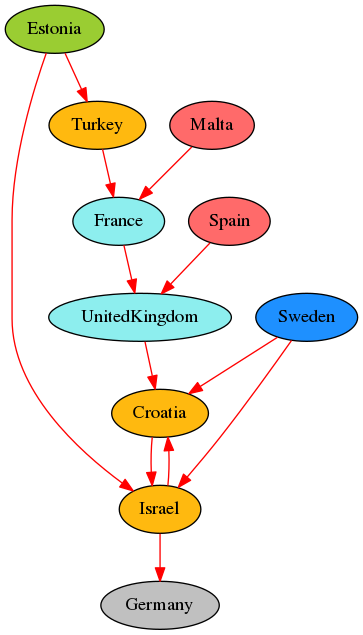
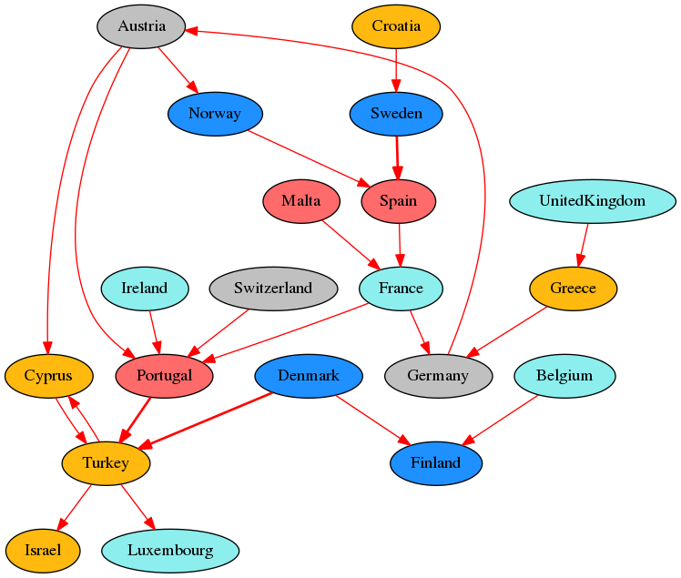
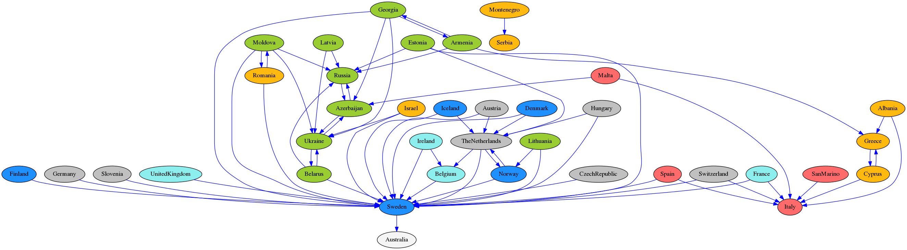
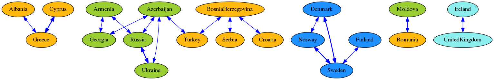
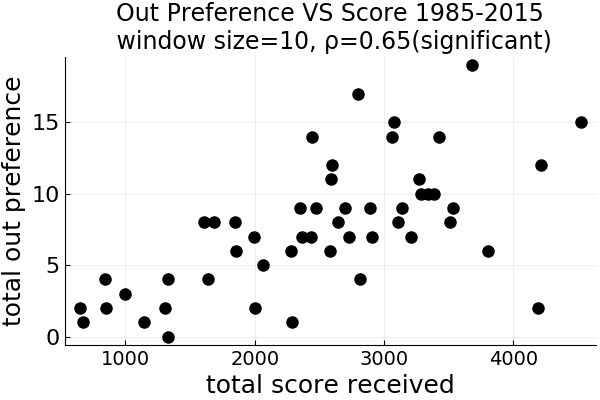
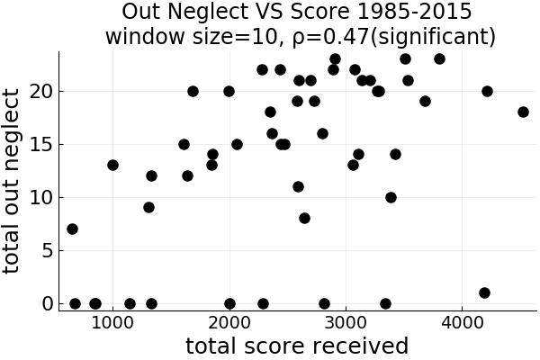

# eurovisionBias
Distributional distances ranked from score data in the Eurovision song contest and what associations with score exists with the preferential links.

Mantzaris, A. V., Rein, S. R., & Hopkins, A. D. (2018). Preference and neglect amongst countries in the Eurovision Song Contest. Journal of Computational Social Science, 1(2), 377-390.
https://link.springer.com/article/10.1007/s42001-018-0020-2

and is an extension of the code and research found in https://github.com/mantzaris/eurovision and published in http://jasss.soc.surrey.ac.uk/21/1/1.html

# The code for the paper "Preference and neglect amongst countries in the Eurovision Song Contest. in Journal of Computational Social Science

* It looks at not only the preferential biases where countries allocate statistically higher than expected scores, but also those associations which are statistically *lower* . Separate networks for the preferential links and links of *neglect* are drawn.
* It also analyzes for the period of time chosen and the windows size in years, the association of the number of links (preferential or from neglect) and the scores countries accumulate.

### What is the reasoning for these extensions and why are they important? (what is the motivation?)

* Since the scores a country can allocate are constrained; yes a country can choose to distribute more of them to a select set of countries due to preference, but then the question remains 'from which countries were those points taken that would normally have gotten them?'

* The average audience member is not keeping a log of the scores allocated between countries year over year but they may remember certain biases whether they were preferential (Country X always gives country Y lots of points) or whether they are based on neglect (Country X hardly ever gives country Z any points). That set of associations is maybe easier to remember and then the question arises whether there are any patterns between these opposite biases and the scores countries accumulate.

* This can be used to question whether the biased votes emerge because audience members see these biases as means to the end of succeeding in the competition. The results show that neglect does not associate with reduced total score so there is no perception of cost for neglecting countries and results also show that preferential biases associate with larger score accumulations probably for reciprocal behavior. (more in the paper can be found)

#### Looking at years 2000-2005 and the edges of NEGLECT (significant low votes) between countries 

 

#### Looking at the years 1980-2000 and the edges of NEGLECT (significant low votes) between countries 

 

#### Looking at the years 2012-2017 and the edges of PREFERENCE (significant high votes) between countries 

 

#### Looking at the years 2000-2016 and the edges of PREFERENCE (significant high votes) between countries that collude as mutually high votes

 

#### Looking at the years 1985-2015 and the TOTAL SCORE RECEIVED vs the TOTAL PREFERENCE produced (biased links to other countries over the years where each dot is a country's accumulation each decade in that time period

 

#### Looking at the years 1985-2015 and the TOTAL SCORE RECEIVED vs the TOTAL NEGLECT produced (biased links to other countries over the years where each dot is a country's accumulation each decade in that time period

 

biasAssociationPlots/scatterScoreVSpreferenceIn19852015win10alpha005.png
